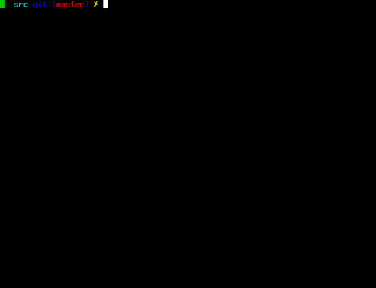

Zcash v1.0.0-compat

===========

This repository hosts a `zcashd` wallet compatibility shim for legacy users of
the `zcashd` wallet software for Transparent and Sapling transactions. `zcashd`
used to be the main consensus node of Zcash, but is now deprecated in favor of
[Zakura](https://github.com/zakura-core/zakura/) and
[Zebra](https://github.com/ZcashFoundation/zebra).

To run this, you must also configure a
[Zakura](https://github.com/zakura-core/zakura/) node for the true live
consensus rules. All block data received by the `zcashd` wallet is checked
twice, once with mainnet Zakura and once with `zcashd`.

To support the Zcashd wallet, it downloads and stores the entire history of Zcash
transactions. Depending on the speed of your computer and network
connection, the synchronization process could take several days. This
implementation performs blockchain consensus validation, but does not expose
APIs for mining. Mining users should use
[Zakura](https://github.com/zakura-core/zakura/).

Get started quickly with our installer:
`curl -fsSL https://raw.githubusercontent.com/zakura-core/zakura/main/scripts/install-zakura.sh | bash`

Or see the full docs here:
https://github.com/zakura-core/zakura/blob/main/book/src/user/zcashd-compat.md

> ## Compatibility support policy
>
> Unlike original `zcashd`, this Valargroup compatibility build has no
> scheduled End of Life and does not halt or warn at an End-of-Support block
> height. Valargroup reserves the right to announce a future End of Life
> through a Zakura compatibility release. Integrators are encouraged to migrate to
> [Zakura](https://github.com/zakura-core/zakura) and monitor its
> [CHANGELOG](https://github.com/zakura-core/zakura/blob/main/CHANGELOG.md).

> ## Zakura sidecar build
>
> This Valargroup compatibility branch is a P2P sidecar build for Zakura. The
> binary hard-locks P2P networking to exactly one `-connect=<zakura-address>`
> peer, refuses listener/additional-peer options, and does not register the
> `addnode` RPC.

What is Zcash?
--------------

[Zcash](https://z.cash/) is HTTPS for money.

Initially based on Bitcoin's design, Zcash has been developed from
the Zerocash protocol to offer a far higher standard of privacy and
anonymity. It uses a sophisticated zero-knowledge proving scheme to
preserve confidentiality and hide the connections between shielded
transactions. More technical details are available in our
[Protocol Specification](https://zips.z.cash/protocol/protocol.pdf).

## The `zcashd` Full Node

This repository hosts the `zcashd` software, a Zcash consensus node
implementation. It downloads and stores the entire history of Zcash
transactions. Depending on the speed of your computer and network
connection, the synchronization process could take several days.

<p align="center">
  
</p>

The `zcashd` code is derived from a source fork of
[Bitcoin Core](https://github.com/bitcoin/bitcoin). The code was forked
initially from Bitcoin Core v0.11.2, and the two codebases have diverged
substantially.

## Getting Started

Please see our [user
guide](https://zcash.readthedocs.io/en/latest/rtd_pages/rtd_docs/user_guide.html)
for instructions on joining the main Zcash network.

### Need Help?

* :blue_book: See the documentation at the [ReadTheDocs](https://zcash.readthedocs.io)
  for help and more information.
* :incoming_envelope: Ask for help on the [Zcash forum](https://forum.zcashcommunity.com/).
* :speech_balloon: Join our community on the [Zcash Global Discord](https://discord.com/invite/zcash).
* 🧑‍🎓: Learn at [ZecHub](https://zechub.wiki/)

Participation in the Zcash project is subject to a
[Code of Conduct](code_of_conduct.md).

### Building

Build Zcash along with most dependencies from source by running the following command:

```
./zcutil/build.sh -j$(nproc)
```

Currently, Zcash is only officially supported on Debian and Ubuntu. See the
[Debian / Ubuntu build page](https://zcash.readthedocs.io/en/latest/rtd_pages/Debian-Ubuntu-build.html)
for detailed instructions.

License
-------

For license information see the file [COPYING](COPYING).
